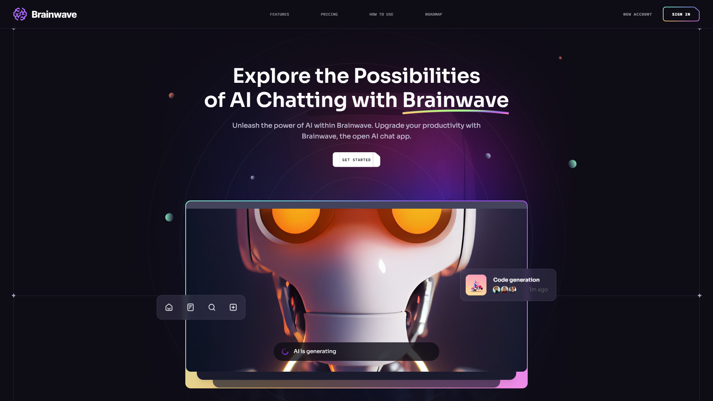

<div align="center">

  # Ashutosh Bhole's Portfolio 🚀

 <!-- update this -->


  [](https://ashutoshbhole.vercel.app)
  <!-- [](https://github.com/ashutoshbhole1) -->
  [](https://linkedin.com/in/ashutoshbholeofficial)
  [](https://ashutoshbhole.vercel.app)
  [](https://nextjs.org)

  <p align="center">
    
  </p>

  <h3>Full Stack Developer | MERN Specialist </h3>

  [View Live Demo](https://ashutoshbhole.vercel.app) 
  <!-- <a href="https://ashutoshbhole.vercel.app" target="_blank">🌐 Visit</a> -->


</div>

## 🌟 Overview

A modern, responsive portfolio website showcasing my journey as a Full Stack Developer. Built with Next.js and Tailwind CSS, this portfolio demonstrates my expertise in web development through interactive UI components and seamless user experience.

## ✨ Key Features

<div align="center">

| Feature | Description |
|---------|------------|
| 🎨 Modern Design | Sleek dark theme with beautiful gradients |
| 📱 Responsive | Optimized for all devices |
| ⚡ Fast Performance | Optimized loading and rendering |
| 🔍 Smart Search | Real-time search across portfolio |
| 🎭 Animations | Smooth transitions with Framer Motion |
| 📊 Analytics | Built-in performance monitoring |
| 🔒 Security Headers | Enhanced security configurations |
| 🤖 SEO Optimized | Search engine friendly structure |

</div>

## 🚀 Tech Stack

<div align="center">

| Frontend | Backend | Database | Tools |
|----------|---------|----------|-------|
| Next.js | Node.js | MongoDB | VS Code |
| React | Express | MySQL | Git |
| TypeScript | REST API | NoSQL | Vercel |
| Tailwind CSS | WebSocket | Redis | Docker |

</div>

<!-- ## 🛠️ Quick Start

```bash
# Clone the repository
git clone https://github.com/niladri-1/Software-Dev-Portfolio.git

# Install dependencies
npm install

# Start development server
npm run dev

# Build for production
npm run build
``` -->

## 📱 Mobile Features

- 📱 Responsive navigation
- 🔍 Mobile-optimized search
- 👆 Touch-friendly interactions
- 🖼️ Optimized images
- 📊 Mobile performance metrics

## 🎯 Core Sections

<div align="center">

| Section | Description |
|---------|------------|
| 🏠 Home | Welcome and introduction |
| 👨‍💻 About | Professional background |
| 📂 Projects | Development portfolio |
| 💼 Experience | Work history |
| 🎓 Education | Academic background |
| 🏆 Certificates | Professional certifications |
| 📞 Contact | Get in touch |

</div>

## 🔍 SEO Keywords

<div align="center">

`Ashutosh Bhole Full Stack Developer` · `ashutoshbhole` · `Ashutosh Bhole` · `Software Developer` · `Full Stack Developer` · `MERN Stack` · `Web Developer` · `React Developer` · `Next.js Expert` · `Frontend Specialist` · `Backend Developer` · `JavaScript Expert` · `TypeScript Developer` · `Node.js Developer` · `MongoDB Expert` · `SQL Developer`

</div>

<!-- ## 📞 Let's Connect

<div align="center">

[](mailto:ashutoshbhole1@gmail.com)
[](https://linkedin.com/in/ashutoshbholeofficial)
[](https://github.com/ashutoshbhole1)
[](https://wa.me/+916296554939)

</div> -->

